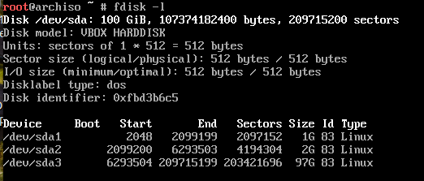

# Configuración de ArchLinux

## Tabla de contenido

- [Configuración de ArchLinux](#configuración-de-archlinux)
  - [Tabla de contenido](#tabla-de-contenido)
  - [Configuración inicial](#configuración-inicial)
    - [Configuración de teclado](#configuración-de-teclado)
    - [Acceso a Internet](#acceso-a-internet)
    - [Configuración de la hora](#configuración-de-la-hora)
  - [Particiones de discos duros](#particiones-de-discos-duros)
    - [Formatear las particiones](#formatear-las-particiones)
  - [Configuración del sistema](#configuración-del-sistema)
    - [FSTAB](#fstab)
    - [Cambiar el root](#cambiar-el-root)
    - [Zona horaria](#zona-horaria)
    - [Idioma del sistema](#idioma-del-sistema)
    - [Configurar hostname](#configurar-hostname)
    - [Generar contraseña de root](#generar-contraseña-de-root)
    - [Instalar el boot](#instalar-el-boot)
  - [Ambiente de gráfico](#ambiente-de-gráfico)
  - [Salir de la configuración](#salir-de-la-configuración)

## Configuración inicial

### Configuración de teclado

`loadkeys la-latin1`

Para configurar el teclado de forma persistente, hay que editar el archivo `/etc/vconsole.conf`:

```bash
KEYMAP=la-latin1

```

### Acceso a Internet

```bash
ip link
ping 8.8.8.8
```

### Configuración de la hora

```bash
timedatectl set-ntp true
timedatectl set-timezone America/Mexico_City
```
## Particiones de discos duros

```bash
fdisk -l
fdisk /dev/sda
n
p
+1G
```

Ejemplo con un disco de 100G:

| Partición | Tipo | Tamaño |
| :---: | :---: | :---: |
| /mnt/boot | boot | +1G |
| [swap] | swap | +2G |
| / | root | resto ~97G |



### Formatear las particiones

1) Crear las particiones para el *boot* y para *root*:

```bash
mkfs.fat -F32 /dev/sda1
mkfs.ext4 /dev/sda3
```

2) Crear el SWAP:

```bash
mkswap /dev/sda2
swapon /dev/sda2
```

3) Montar las particiones:

```bash
mount /dev/sda3 /mnt
mkdir /mnt/efi
mount /dev/sda1 /mnt/boot/efi
```

4) Installar Kernel de Linux:

```bash
pacstrap /mnt base linux linux-firmware
```

## Configuración del sistema

### FSTAB

```bash
genfstab -U /mnt >> /mnt/etc/fstab
cat /mnt/etc/fstab
```

### Cambiar el root

```bash
arch-chroot /mnt
```

### Zona horaria

```bash
ln -sf /usr/share/zoneinfo/America/Mexico_City /etc/localtime
hwclock --systohc
```

### Idioma del sistema

```bash
locale-gen
vi /etc/locale.conf
```

### Configurar hostname

```bash
echo "arch" > /etc/hostname 
```

### Generar contraseña de root

```bash
passwd
```

### Instalar el boot

```bash
pacman -S grub efibootmgr amd-ucode intel-ucode dosfstools
grub-install --target=x86_64-efi --bootloader-id=GRUB --efi-directory=/boot/efi
grub-mkconfig -o /boot/grub/grub.cfg
```

## Ambiente de gráfico

```bash
pacman -S xorg gnome
systemctl start gdm.service
systemctl enable gdm.service
systemctl enable NetworkManager.service
```

## Salir de la configuración

```bash
exit
umount -R /mnt
reboot now
```
