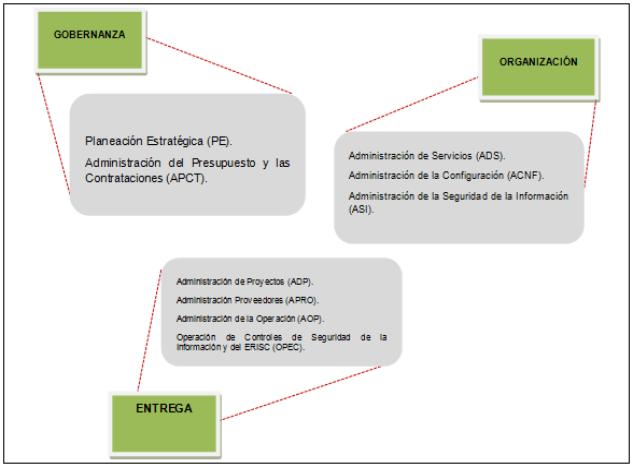

# ACUERDO POR EL QUE SE MODIFICAN LAS POLÍTICAS Y DISPOSICIONES PARA LA ESTRATEGIA DIGITAL NACIONAL, EN MATERIA DE TECNOLOGÍAS DE LA INFORMACIÓN Y COMUNICACIONES, Y EN LA DE SEGURIDAD DE LA INFORMACIÓN, ASÍ COMO EL MANUAL ADMINISTRATIVO DE APLICACIÓN GENERAL EN DICHAS MATERIAS

Acuerdo publicado en el *Diario Oficial de la Federación el 08 de mayo de 2014*

Última reforma publicada *DOF 23-07-2018*

---

## Tabla de contenido

- [ACUERDO POR EL QUE SE MODIFICAN LAS POLÍTICAS Y DISPOSICIONES PARA LA ESTRATEGIA DIGITAL NACIONAL, EN MATERIA DE TECNOLOGÍAS DE LA INFORMACIÓN Y COMUNICACIONES, Y EN LA DE SEGURIDAD DE LA INFORMACIÓN, ASÍ COMO EL MANUAL ADMINISTRATIVO DE APLICACIÓN GENERAL EN DICHAS MATERIAS](#acuerdo-por-el-que-se-modifican-las-políticas-y-disposiciones-para-la-estrategia-digital-nacional-en-materia-de-tecnologías-de-la-información-y-comunicaciones-y-en-la-de-seguridad-de-la-información-así-como-el-manual-administrativo-de-aplicación-general-en-dichas-materias)
  - [Tabla de contenido](#tabla-de-contenido)
    - [Artículo 1](#artículo-1)
    - [Artículo 2](#artículo-2)
    - [Artículo 3](#artículo-3)
  - [Capítulo III. Políticas para instrumentar la Estrategia Digital Nacional](#capítulo-iii-políticas-para-instrumentar-la-estrategia-digital-nacional)
    - [Artículo 4](#artículo-4)
    - [Artículo 4 BIS](#artículo-4-bis)
    - [Artículo 4 TER](#artículo-4-ter)
    - [Artículo 5](#artículo-5)
    - [Artículo 6](#artículo-6)
    - [Artículo 7](#artículo-7)
    - [Artículo 8](#artículo-8)
    - [Artículo 9](#artículo-9)
    - [Artículo 10](#artículo-10)
    - [Artículo 11](#artículo-11)
    - [Artículo 12](#artículo-12)
    - [Artículo 13](#artículo-13)
    - [Artículo 14](#artículo-14)
    - [Artículo 15](#artículo-15)
    - [Artículo 16](#artículo-16)
    - [Artículo 17](#artículo-17)
    - [Artículo 18](#artículo-18)
    - [Artículo 19](#artículo-19)
    - [Artículo 20](#artículo-20)
  - [Capítulo IV. Disposiciones generales para la seguridad de la información](#capítulo-iv-disposiciones-generales-para-la-seguridad-de-la-información)
    - [Artículo 21](#artículo-21)
    - [Artículo 22](#artículo-22)
    - [Artículo 23](#artículo-23)
    - [Artículo 24](#artículo-24)
    - [Artículo 25](#artículo-25)
    - [Artículo 26](#artículo-26)
    - [Artículo 27](#artículo-27)
    - [Artículo 28](#artículo-28)
    - [Artículo 29](#artículo-29)
  - [Capítulo V. Interpretación, Seguimiento y Vigilancia](#capítulo-v-interpretación-seguimiento-y-vigilancia)
    - [Artículo 30](#artículo-30)
    - [Artículo 31](#artículo-31)
    - [Artículo 32](#artículo-32)
  - [TRANSITORIOS](#transitorios)
  - [OBJETIVOS](#objetivos)
    - [Objetivo General](#objetivo-general)
    - [Objetivos Específicos](#objetivos-específicos)
  - [ÁMBITO DE APLICACIÓN](#ámbito-de-aplicación)
  - [MARCO JURÍDICO](#marco-jurídico)
  - [DEFINICIONES](#definiciones)
  - [REGLAS GENERALES](#reglas-generales)
  - [PROCESOS EN LAS MATERIAS DE TIC Y DE SEGURIDAD DE LA INFORMACIÓN](#procesos-en-las-materias-de-tic-y-de-seguridad-de-la-información)
    - [I. PROCESOS DE GOBERNANZA](#i-procesos-de-gobernanza)
    - [II. PROCESOS DE ORGANIZACIÓN](#ii-procesos-de-organización)
      - [III. PROCESOS DE ENTREGA](#iii-procesos-de-entrega)
  - [IV. APÉNDICES](#iv-apéndices)

> **ARTÍCULO PRIMERO.- SE REFORMAN** el primer párrafo del artículo 1; 2; segundo párrafo del artículo 3; el título del Capítulo III; 4 BIS; el párrafo primero y fracción IX del artículo 5; las fracciones I y III del artículo 6; 8; 9; primer párrafo y las fracciones I, II, V, VII, X y XI del artículo 10; las fracciones V y VI del artículo 11; las fracciones IV y VIII del artículo 13; las fracciones II, III y IV del artículo 14; las fracciones I y II del artículo 15; las fracciones I y IX del artículo 17; la fracción V del artículo 19; la fracción VIII del artículo 27 y el último párrafo del artículo 28; **SE ADICIONAN** un párrafo segundo al artículo 4; el artículo 4 TER; un párrafo segundo al artículo 7; un segundo párrafo a la fracción II y la fracción XII al artículo 10; la fracción IX y un segundo párrafo al artículo 13 y la fracción III al artículo 15 del Acuerdo que tiene por objeto emitir las políticas y disposiciones para la Estrategia Digital Nacional, en materia de tecnologías de la información y comunicaciones, y en la de seguridad de la información, así como establecer el Manual Administrativo de Aplicación General en dichas materias y el diverso que lo modifica, para quedar como sigue:

### Artículo 1

El presente Acuerdo tiene por objeto emitir políticas y disposiciones para la instrumentación de la Estrategia Digital Nacional, en materia de Tecnologías de la Información y Comunicaciones, y en la de seguridad de la información, así como establecer el Manual Administrativo de Aplicación General en dichas materias, contenido en su Anexo Único, que serán de observancia obligatoria en la Administración Pública Federal y en la Procuraduría General de la República.

Las Secretarías de la Defensa Nacional y de Marina, así como el Comisionado Nacional de Seguridad, las unidades administrativas y órganos administrativos desconcentrados adscritos a éste, y el Centro, en atención a las atribuciones a su cargo, estarán exceptuadas de la aplicación de lo dispuesto en el presente Acuerdo y su Anexo Único cuando ello pueda vulnerar su operación.

### Artículo 2

Para los efectos del presente Acuerdo, se entiende por:

- **Accesibilidad:** las medidas pertinentes para asegurar el acceso de las personas con discapacidad, en igualdad de condiciones con los demás, al entorno físico, el transporte, la información y las comunicaciones, incluidos los sistemas y las TIC y a otros servicios e instalaciones abiertos al público o de uso público, tanto en zonas urbanas como rurales de conformidad a la Ley General para la Inclusión de las Personas con Discapacidad;
- **Activos de TIC:** los aplicativos de cómputo, bienes informáticos, soluciones tecnológicas, sus componentes, las bases de datos o archivos electrónicos y la información contenida en éstos;
- **Acuerdo:** el Acuerdo que tiene por objeto emitir las políticas y disposiciones para la Estrategia Digital Nacional, en materia de tecnologías de la información y comunicaciones, y en la de seguridad de la información, así como establecer el manual administrativo de aplicación general en dichas materias;
- **Aplicativo de Cómputo:** el software y/o los sistemas informáticos, que se conforman por un conjunto de componentes o programas construidos con herramientas que habilitan una funcionalidad o digitalizan un proceso, de acuerdo a requerimientos previamente definidos;
- **Arquitectura Empresarial:** la información del estado actual y futuro de una Institución, a partir del análisis con perspectiva estratégica; considerando modelos de negocio, procesos, aplicativos y tecnologías de la información y comunicaciones;
- **Arquitectura Orientada a Servicios:++ la metodología y marco de trabajo, para construir componentes de software reutilizables para la interoperabilidad de aplicativos de cómputo;
- **Bases de Colaboración:** los instrumentos consensuales celebrados por las Instituciones para establecer acciones que modernicen y mejoren la prestación de los servicios públicos, promocionen la productividad en el desempeño de sus funciones y reduzcan gastos de operación, a fin de incrementar la eficiencia y eficacia y cumplir con los objetivos previstos en el Programa y formalizar los compromisos, así como sus respectivos indicadores de desempeño;
- **Borrado Seguro:** el proceso mediante el cual se elimina de manera permanente y de forma irrecuperable la información contenida en medios de almacenamiento digital;
- **Cartera Ejecutiva de Proyectos de TIC:** Conjunto total de proyectos de TIC que la institución propondrá a la Unidad para su seguimiento;
- **Cartera Operativa de Proyectos de TIC:** Conjunto total de proyectos que soportan la operación diaria de la UTIC y no son considerados como estratégicos;
- **Centro:** el Centro de Investigación y Seguridad Nacional, órgano desconcentrado de la Secretaría de Gobernación;
- **Centro de Datos:** el lugar físico en los que se ubiquen los activos de TIC y desde el que se proveen servicios de TIC;
- **CNTSE:** el Catálogo Nacional de Trámites y Servicios del Estado, al que se alude en el Programa;
- **Cómputo en la Nube:** al modelo de prestación de servicios digitales que permite a las Instituciones acceder a un catálogo de servicios digitales estandarizados, los cuales pueden ser: de infraestructura como servicios, de plataforma como servicios y de software como servicios;
- **Decreto:** el Decreto que establece las medidas para el uso eficiente, transparente y eficaz de los recursos públicos, y las acciones de disciplina presupuestaria en el ejercicio del gasto público, así como para la modernización de la Administración Pública Federal, publicado en el Diario Oficial de la Federación el 10 de diciembre de 2012;
- **Decreto de Datos Abiertos:** el Decreto por el que se establece la regulación en materia de Datos Abiertos publicado en el Diario Oficial de la Federación el 20 de febrero de 2015;
- **Dependencias:** las Secretarías de Estado, incluyendo a sus órganos administrativos desconcentrados y la Consejería Jurídica del Ejecutivo Federal, así como a la Oficina de la Presidencia de la República y la Procuraduría General de la República; así como los Órganos Reguladores Coordinados en Materia Energética;
- **Dictamen Técnico:** el resultado del análisis de la contratación sometida a estudio de la Unidad, a través del cual se verifica que la misma sea en materia de TIC y/o TO, su alineación a la Estrategia Digital Nacional, así como el cumplimiento de los requisitos formales que establece este Acuerdo;
- **Diseminación:** la transmisión o entrega de información considerada de seguridad nacional, a quienes cumplan con los requisitos para conocer esa información, de acuerdo con el nivel de acceso autorizado;
- **Dominio Tecnológico:** las agrupaciones lógicas de TIC denominadas dominios, que conforman la arquitectura tecnológica de la Institución, los cuales podrán ser, entre otros, los grupos de seguridad, cómputo central y distribuido, cómputo de usuario final, telecomunicaciones, colaboración y correo electrónico, internet, intranet y aplicativos de cómputo;
- **EDN:** la Estrategia Digital Nacional contenida en el Objetivo número 5 del Programa;
- **EIDA:** el Esquema de Interoperabilidad y de Datos Abiertos de la Administración Pública Federal, establecido mediante Acuerdo publicado en el Diario Oficial de la Federación el 6 de septiembre de 2011;
- **Entidades:** los organismos descentralizados, empresas de participación estatal mayoritaria, instituciones nacionales de crédito, organizaciones auxiliares nacionales de crédito e instituciones nacionales de seguros y de fianzas, y fideicomisos públicos que en términos de la Ley Orgánica de la Administración Pública Federal y de la Ley Federal de las Entidades Paraestatales, sean considerados entidades de la Administración Pública Federal Paraestatal;
- **ERISC:** equipo de respuesta a incidentes de seguridad en TIC en la Institución;
- **Esquema de Tiempo y Materiales:** los servicios en que el proveedor asigna, durante un periodo, un determinado número de recursos humanos, que cumplirán actividades definidas mediante un contrato;
- **Estándar abierto:** a las especificaciones cuya utilización esté disponible de manera gratuita o que no suponga una dificultad de acceso, y que su uso y aplicación no esté condicionada al pago de un derecho de propiedad;
- **Herramienta de Gestión de la Política TIC:** el sistema web de control y gestión de las actividades establecidas en el presente Acuerdo y en el MAAGTICSI, considerando el reporte de PETIC, la obtención del Dictamen Técnico y Visto Bueno que emite la Unidad, la Arquitectura Empresarial, reporte de cumplimiento de obligaciones, entre otros;
- **Identidad Digital:** la información y datos que permiten identificar de manera individual e inequívoca  los atributos de una persona física o moral, por medio de la Clave Única de Registro de Población o la clave del Registro Federal de Contribuyentes, o firma electrónica avanzada (e.firma); a título personal o a través de su representante legal, con la finalidad de acceder a un aplicativo de cómputo o un servicio electrónico y que permite darle trazabilidad a las acciones realizadas ante el mismo.
- **Infraestructura Activa:** elementos de las redes de telecomunicaciones o radiodifusión que almacenan, emiten, procesan, reciben o transmiten escritos, imágenes, sonidos, señales, signos o información de cualquier naturaleza;
- **Infraestructuras Críticas de Información:** Las infraestructuras de información esenciales consideradas estratégicas, por estar relacionadas con la provisión de bienes y prestación de servicios públicos esenciales, y cuya afectación pudiera comprometer la Seguridad Nacional en términos de la Ley de la materia;
- **Infraestructuras de Información esenciales:** Las redes, servicios, equipos e instalaciones asociados o vinculados con activos de información, TIC y TO, cuya afectación, interrupción o destrucción tendría un impacto mayor en la operación de las Instituciones;
- **Infraestructura de TIC:** el hardware, software, redes e instalaciones requeridas para desarrollar, probar, proveer, monitorear, controlar y soportar los servicios de TIC;
- **Infraestructura Pasiva:** elementos accesorios que proporcionan soporte a la infraestructura activa, entre otros, bastidores, cableado subterráneo y aéreo, canalizaciones, construcciones, ductos, obras, postes, sistemas de suministro y respaldo de energía eléctrica, sistemas de climatización, sitios, torres y demás aditamentos, dentro de las instalaciones de las dependencias o entidades, que sean necesarios para la instalación y operación de las redes, así como para la prestación de servicios de procesamiento de datos, de telecomunicaciones y radiodifusión;
- **Instancias de Seguridad Nacional:** las Instituciones o autoridades que en función de sus atribuciones participen directa o indirectamente en la seguridad nacional, conforme a lo dispuesto en la fracción II del artículo 6 de la Ley de Seguridad Nacional, incluidas aquellas que tengan reconocido dicho carácter por Acuerdo tomado en el seno del Consejo de Seguridad Nacional;
- **Institución:** las dependencias y entidades de la Administración Pública Federal, tal y como se definen en este Acuerdo;
- **Lineamientos:** los Lineamientos para la aplicación y seguimiento de las medidas para el uso eficiente, transparente y eficaz de los recursos públicos, y las acciones de disciplina presupuestaria en el ejercicio del gasto público, así como para la modernización de la Administración Pública Federal, publicados en el Diario Oficial de la Federación el 30 de enero de 2013;
- **MAAGMAASSP:** el Manual Administrativo de Aplicación General en Materia de Adquisiciones, Arrendamientos y Servicios del Sector Público;
- **MAAGTICSI:** el Manual Administrativo de Aplicación General en las materias de tecnologías de la información y comunicaciones, y en la de seguridad de la información. Anexo Único del presente Acuerdo;
- **Niveles de servicio:** el establecimiento en un lenguaje no técnico del servicio brindado, incluyendo al menos la definición, disponibilidad, calidad, tiempos de respuesta y solución;
- **PETIC:** el conjunto de proyectos que elaboran las Instituciones, conformado por un máximo de 7 proyectos estratégicos, en los términos establecidos en el presente Acuerdo;
- **Portafolio de proyectos de TIC:** es el total de los proyectos de TIC agrupados según su clasificación en Cartera Ejecutiva de Proyectos de TIC y Cartera Operativa de Proyectos de TIC que la Institución planea desarrollar, en los términos establecidos por el MAAGTICSI;
- **Procesamiento de Datos:** cualquier ordenación o tratamiento de datos (elementos básicos de información) que se lleva a cabo de manera automática por medio de sistemas o aplicativos de cómputo;
- **Programa:** el Programa para un Gobierno Cercano y Moderno 2013-2018, aprobado mediante Decreto publicado en el Diario Oficial de la Federación el 30 de agosto de 2013;
- **Proyectos de TIC:** el esfuerzo temporal que se lleva a cabo para crear un producto, servicio o resultado de TIC y que cuenta con presupuesto para su ejecución; considerando 2 tipos: proyectos operativos que soportan las actividades diarias de la UTIC y proyectos estratégicos en los términos señalados en el presente Acuerdo;
- **Retos Públicos:** el modelo que fomenta la democratización del gasto público y la innovación, invitando a los emprendedores del país a plantear soluciones a retos de gobierno mediante el desarrollo de aplicativos tecnológicos web y móviles;
- **SEGOB:** la Secretaría de Gobernación;
- **Seguridad de la Información:** la capacidad de preservar la confidencialidad, integridad y disponibilidad de la información, así como la autenticidad, confiabilidad, trazabilidad y no repudio de la misma;
- **Seguridad Nacional:** las acciones a las que se refiere el artículo 3 de la Ley de Seguridad Nacional;
- **SFP:** la Secretaría de la Función Pública;
- **SHCP:** la Secretaría de Hacienda y Crédito Público;
- **Software Público:** el creado por entes públicos y puesto a disposición de entes públicos y privados bajo los principios de software libre, estándares abiertos y de código abierto que promuevan la colaboración, innovación y sustentabilidad;
- **Tecnologías verdes:** el conjunto de mecanismos y acciones sobre el uso y aprovechamiento de las tecnologías de la información y comunicaciones, que reducen el impacto de éstas sobre el medio ambiente, contribuyendo a la sustentabilidad ambiental; considerando inclusive el reciclaje de componentes utilizados en el uso de estas tecnologías;
- **TIC:** las Tecnologías de la Información y Comunicaciones que comprenden el equipo de cómputo, software, dispositivos de impresión, infraestructura y servicios que sean utilizadas para almacenar, procesar, convertir, proteger, transferir y recuperar información, datos, voz, imágenes y video;
- **TO:** las Tecnologías de Operación que comprenden el hardware o software que detecta o genera un cambio a través del control y/o monitoreo de dispositivos físicos, procesos y eventos en las Instituciones;
- **Unidad:** la Unidad de Gobierno Digital de la SFP;
- **UPCP:** la Unidad Política de Control Presupuestario de la SHCP;
- **UTIC:** la Unidad de Tecnologías de Información y Comunicaciones o área responsables de las TIC en la Institución;
- **Ventanilla Única Nacional:** la establecida a través del Decreto publicado en el Diario Oficial de la Federación el 3 de febrero de 2015, y
- **Visto Bueno:** la validación técnica de la Unidad en términos del cumplimiento del estándar de servicios digitales conforme a los criterios técnicos, metodologías, guías, instructivos y demás instrumentos análogos que emita la propia Unidad.

### Artículo 3

La aplicación de las políticas y disposiciones contenidas en el presente Acuerdo y su Anexo Único, corresponde a los Titulares de las unidades administrativas o áreas responsables de las TIC en las Instituciones, así como a los servidores públicos cuyas atribuciones o funciones estén relacionadas con la planeación, contratación y administración de bienes y servicios de TIC y con la seguridad de la información.

El Órgano Interno de Control competente, podrá emitir las sugerencias u observaciones que de manera fundada y motivada considere pertinentes, derivado de la observancia de este Acuerdo y su Anexo, a través de la Herramienta de Gestión de la Política TIC.

## Capítulo III. Políticas para instrumentar la Estrategia Digital Nacional

### Artículo 4

La planeación estratégica de TIC que elaboren las Instituciones, deberá atender las metas nacionales, estrategias, objetivos y líneas de acción e indicadores, establecidos en el Plan Nacional de Desarrollo 2013-2018, la EDN, así como las disposiciones establecidas en el Decreto y en las Bases de Colaboración que haya suscrito cada Institución.

Las Instituciones deberán facilitar un ambiente de innovación tecnológica abierta, sustentable y colaborativa con el fin de fortalecer el desarrollo del país, conforme a la normatividad aplicable; propiciando, entre otros, el ahorro de recursos humanos y económicos respecto a los requerimientos tecnológicos en materia de software para la Administración Pública Federal y la Procuraduría General de la República.

### Artículo 4 BIS

El modelo de contrataciones en materia de tecnología de la información y comunicación deberá adoptar y desarrollar estándares abiertos que permitan la implementación de la interoperabilidad, escalabilidad, sostenibilidad, estabilidad, así como flexibilidad ante la evolución tecnológica, considerando el fomento de la neutralidad tecnológica y el mejor beneficio para el Estado, atendiendo los objetivos del proyecto al que se destine la tecnología a contratar. Asimismo, deberá contribuir en la adopción e implementación de la política de software público que sea emitida por la Unidad.

### Artículo 4 TER

Las Instituciones cuyos sitios se encuentren en proceso de migración al portal www.gob.mx, deberán publicar los Términos de libre uso de datos bajo los cuales se indique al público usuario las actividades y las condiciones que pueden aplicar respecto de los datos ahí contenidos y que de conformidad con la normatividad aplicable sean considerados de libre uso.

Para aquellos sitios que se encuentren migrados al portal www.gob.mx resultarán aplicables los términos de libre uso de dicho portal.

### Artículo 5

El Portafolio de Proyectos de TIC se sujetará a lo dispuesto en los artículos 4 y 4 BIS, para lo cual atenderá lo siguiente:

1. Favorecer el uso del cómputo en la nube para el aprovechamiento de la economía de escala, eficiencia en la gestión gubernamental, fomentando la utilización de las TIC, los estándares abiertos y teniendo en consideración la seguridad de la información y la protección de datos personales;
2. Privilegiar la aplicación de Tecnologías Verdes;
3. Establecer una ficha técnica base, de acuerdo al formato establecido en la Herramienta de Gestión de la Política TIC, para cada una de las Iniciativas y Proyectos de TIC, en la cual se registre el presupuesto estimado y, de ser el caso, el presupuesto autorizado para el ejercicio fiscal, así como necesidades adicionales en este rubro;
4. Identificar los Proyectos de TIC que aporten mayores beneficios a la población o cuenten con alto impacto en el cumplimiento de los objetivos institucionales, de la EDN y del Decreto, en el ámbito de sus atribuciones, identificándolos como estratégicos;
5. Identificar las estrategias, líneas de acción y habilitadores de la EDN contenidas en el Programa, a las cuales contribuirán para su cumplimiento;
6. Relacionar las características, especificaciones y estándares generales de los principales componentes por cada dominio tecnológico;
7. Determinar Iniciativas y Proyectos de TIC para la digitalización de los trámites y servicios registrados en el CNTSE, considerando estrategias de interoperabilidad con aplicativos de cómputo de otras Instituciones que resulten necesarios para la prestación de esos trámites y servicios;
8. Establecer estrategias de interoperabilidad al interior de la propia Institución y con otras Instituciones que requieran compartir datos que obren en su posesión, puedan o no formar parte de un mismo proceso, y
9. Someter al Visto Bueno de la Unidad, los aplicativos de cómputo para dispositivos móviles que planeen desarrollar o que estén próximos a liberar. Estos deberán dar cumplimiento a los criterios que en materia de gobierno móvil emita la Unidad. La Unidad deberá emitir el Visto Bueno correspondiente en un plazo máximo de 15 días hábiles siguientes a la recepción de la solicitud correspondiente.

### Artículo 6

Una vez elaborada la Cartera Ejecutiva de Proyectos de TIC conforme al proceso de Planeación Estratégica que se establece en el MAAGTICSI, se atenderá lo siguiente:

1. Las Instituciones presentarán a la Unidad, a través de la Herramienta de Gestión de la Política TIC, durante el mes de octubre de cada año, la Cartera Ejecutiva de Proyectos de TIC del año siguiente, la cual deberá de quedar comprendida en un solo paquete; para conformar el PETIC deberán identificar como máximo 7 Proyectos de TIC como estratégicos, considerando como criterios para su identificación, aquellos que aporten mayores beneficios a la población o cuenten con alto impacto en el cumplimiento de los objetivos institucionales, de la EDN, del Programa y del Decreto. Durante la vigencia de dicha Cartera, se podrán realizar las actualizaciones que se consideren pertinentes, mismas que deberán de hacerse del conocimiento de la Unidad para su seguimiento a través de los mecanismos que para ello sean habilitados a través de la Herramienta de Gestión de la Política TIC; Una vez presentada la Cartera Ejecutiva de Proyectos de TIC, la Unidad remitirá a las Instituciones, en su caso, el Visto Bueno de dicha Cartera, a más tardar el 31 de diciembre del año anterior al que corresponda a la Cartera Ejecutiva de Proyectos de TIC presentada. En el supuesto que la Unidad formule observaciones, las Instituciones contarán con 15 días hábiles a partir del día hábil siguiente que se les notifique, para solventarlas y presentar nuevamente su Cartera Ejecutiva de Proyectos de TIC incluido el PETIC; en cuyo caso, la Unidad contará con 15 días hábiles para dar una respuesta;
2. La Unidad seleccionará de la Cartera Ejecutiva de Proyectos de TIC propuestos por las Instituciones, aquéllos a los que dará seguimiento, tomando como base los que aporten mayores beneficios a la población o cuenten con alto impacto en el cumplimiento de los objetivos institucionales, de la EDN, del Programa y del Decreto, y
3. Las Instituciones promoverán el desarrollo de aplicativos de cómputo para dispositivos móviles bajo el modelo de Retos Públicos, asegurando que dichos aplicativos sean acordes con estas políticas y demás disposiciones aplicables.

### Artículo 7

Las Instituciones deberán tomar en cuenta para la optimización interna de los trámites y   servicios, el modelado de la Arquitectura Empresarial, debiendo utilizar las guías, lineamientos, manuales y documentos técnicos de interoperabilidad que para este efecto ponga a disposición la Unidad, a través de su portal.

Asimismo, cuando sea aplicable, deberán asegurarse de que los aplicativos de cómputo o servicios de TIC existentes o por contratar incluyan, como campo llave para la interoperabilidad entre éstos, la Clave Única de Registro de Población y en su caso, otros atributos que permitan verificar la identidad digital correspondiente.

### Artículo 8

Las Instituciones deberán compartir recursos de infraestructura, bienes y servicios en todos los dominios tecnológicos, utilizando soluciones tecnológicas comunes a nivel institucional, sectorial y de la Administración Pública Federal, conforme a los criterios que emita la Unidad, teniendo en consideración la seguridad de la información, la privacidad y protección de datos personales de acuerdo a la normatividad aplicable a la materia.

### Artículo 9

Las Instituciones para la contratación de TIC y/o TO en sus modalidades de adquisición, arrendamiento y servicios, además de sujetarse a las disposiciones que se establecen en la Ley de Adquisiciones, Arrendamientos y Servicios del Sector Público, su Reglamento, el MAAGMAASSP, y demás disposiciones aplicables en la materia, deberán observar lo siguiente:

1. En la planeación de las contrataciones, se sujetarán a las estrategias y líneas de acción de la EDN contenidas en el Programa;
2. En la investigación de mercado que deban realizar para seleccionar el procedimiento de contratación, verificarán si existe algún ente público, con la debida certificación o acreditación que, conforme a su objeto y niveles de servicio, esté en posibilidad de suministrar los bienes o prestar los servicios que se requieran, a efecto de considerarlo en dicha investigación;
3. Para la contratación de servicios, se establecerá en la convocatoria a la licitación pública, en la invitación a cuando menos tres personas, en las solicitudes de cotización, o en el contrato que se celebre, según corresponda, la obligación de presentar, además de los precios unitarios del servicio, un desglose de los componentes técnicos que integren el servicio a prestar, de acuerdo a la normatividad aplicable;
4. Cuando se pretenda adquirir, arrendar o contratar servicios de bienes de TIC y/o TO, las Instituciones deben justificar ante la Unidad, en el estudio de factibilidad, el costo-beneficio de la adquisición, arrendamiento o servicio de que se trate. Quedan exceptuados los arrendamientos o contrataciones de servicios de bienes de TIC y/o TO inferiores al equivalente a trescientas veces el Valor de la Unidad de Medida y Actualización vigente, por lo que no requerirá el Dictamen Técnico de la Unidad. Para el caso de adquisiciones, será necesario el Dictamen Técnico de la Unidad sin importar el monto que éstas impliquen, y
5. Contratar bienes o servicios que respeten los derechos de propiedad intelectual de terceros.

La UTIC registrará en la Herramienta de Gestión de la Política TIC su Estudio de Factibilidad y verificará que se haya anexado lo siguiente:

- El resultado de la investigación de mercado;
- El estudio de costo beneficio;
- El pronunciamiento sobre la existencia de un ente público que esté en posibilidad de suministrar los bienes o prestar los servicios que se requieran, y
- El documento que acredite el inicio del trámite o la autorización, en el caso contrataciones plurianuales.

Dichos documentos deberán ser integrados con los elementos establecidos en las presentes disposiciones jurídicas aplicables a la Herramienta de Gestión de la Política TIC antes referida para después turnarlo al Órgano Interno de Control respectivo para que de conformidad con lo señalado en el numeral 32 de los Lineamientos emita sus sugerencias u observaciones de manera fundada y motivada a través del mismo medio, a más tardar, dentro de los 8 días hábiles siguientes a la recepción. Una vez que la UTIC reciba dicha respuesta podrá enviar el estudio en cuestión a la Unidad.

En el caso de adquisiciones, la Unidad emitirá el dictamen técnico correspondiente a más tardar a los 10 días hábiles posteriores a la recepción de la solicitud y lo turnará a la UPCP junto con la solicitud y sus anexos. La UPCP en el ámbito de sus atribuciones emitirá el pronunciamiento dentro de los 20 días hábiles posteriores a la recepción de la solicitud, tal y como lo establece el numeral 33 de los Lineamientos.

Tratándose de arrendamientos y contratación de servicios de bienes de TIC y/o TO la Unidad emitirá, en su caso, el Dictamen Técnico, a través de la Herramienta de Gestión de la Política TIC, en un término de 15 días hábiles posteriores a la recepción de la solicitud correspondiente. Las solicitudes se tendrán por dictaminadas favorablemente, si transcurrido el plazo señalado la Unidad no emite pronunciamiento alguno.

En caso de que la Unidad requiera mayor información, podrá regresar la solicitud a la Institución y formular el requerimiento respectivo, en dicho caso el cómputo del plazo señalado en los párrafos anteriores se reiniciará una vez que se presente la información requerida.

Para la contratación de servicios de hospedaje de infraestructura y aplicaciones en un centro de datos, incluyendo hospedaje en la nube, las Instituciones deberán solicitar el Dictamen Técnico de la Unidad, de conformidad con el numeral 35 de los Lineamientos, la que emitirá el mismo a más tardar a los 10 días hábiles posteriores a la recepción de la solicitud. En este caso, las Instituciones y los proveedores deberán someterse a la jurisdicción de las leyes y tribunales mexicanos sin importar el territorio en el que los datos se encuentren alojados.

Tratándose de la creación de dominios y apertura de cuentas en redes sociales, las Instituciones deberán solicitar el Visto Bueno de la Unidad. Para tal caso, la Unidad emitirá dicho Visto Bueno en un término de 10 días hábiles posteriores a la recepción de la solicitud correspondiente. Las dependencias y entidades priorizarán el uso del dominio de la cabeza de sector, salvo que la funcionalidad requerida no cubra la funcionalidad estándar de la Ventanilla Única Nacional.

Dicha solicitud se hará atendiendo, entre otras, lo siguiente:

- Deberá ser enviada por la Dependencia o Entidad cabeza de sector por medio del enlace de comunicación digital;
- Se enviará mediante oficio, con copia para el Órgano Interno de Control, que contenga: la funcionalidad y finalidad del sitio, así como el nombre del dominio;
- En caso de sólo requerir la reserva del dominio, esta se realizará por parte de la Unidad de Gobierno Digital, y
- Todo dominio o cuenta de red social que no cuente con el Visto Bueno de la Unidad será dado de baja.

En caso de que la Unidad requiera mayor información, en cualquiera de los casos anteriores, podrá regresar la solicitud a la Institución y formular el requerimiento respectivo. En dicho caso el cómputo del plazo señalado en los párrafos anteriores se reiniciará una vez que se presente la información requerida. En caso de que la Unidad detecte información omisa o imprecisa por segunda ocasión, se negará el Dictamen Técnico o Visto Bueno, según corresponda.

La Unidad se podrá allegar de la opinión de servidores públicos de las diversas dependencias y entidades de la Administración Pública Federal para la emisión del Dictamen Técnico o Visto Bueno correspondiente.

### Artículo 10

En las contrataciones relacionadas con los servicios de desarrollo, implementación, soporte a la operación y mantenimiento de aplicativos de cómputo, las Instituciones deberán prever en las convocatorias a la licitación pública, en las invitaciones a cuando menos tres personas o en las solicitudes de cotización, o bien en cualquier otro contrato que se celebre con otros entes públicos, según corresponda, lo siguiente:

1. Una vez que cuenten con el Dictamen Técnico referido en el artículo anterior, las Instituciones deberán requerir a los participantes en el procedimiento de contratación o al ente público con el que se pretenda contratar, cuando se considere aplicable, la presentación de acreditaciones de Normas Oficiales Mexicanas, Normas Mexicanas y Normas Internacionales en términos de la Ley Federal sobre Metrología y Normalización, así como la certificación de otros estándares o modelos reconocidos por la industria como las mejores prácticas. Previo a establecer el requerimiento de certificaciones o acreditaciones antes mencionado, las Instituciones deberán obtener el Dictamen Técnico favorable de la Unidad, para lo cual presentarán la justificación correspondiente a través de la Herramienta de Gestión de la Política TIC, sujetándose a los plazos establecidos en el artículo 9 de este Acuerdo;
2. Incluir el diseño detallado del aplicativo que se vaya a desarrollar, considerando por lo menos, requerimientos del negocio, de seguridad de la información, de privacidad y protección de datos personales, técnicos, casos de uso, módulos, matriz de trazabilidad y protocolos de pruebas; así como el uso de la Identidad Digital y, en su caso, lo dispuesto en los artículos 19, fracción IV y 26 del presente Acuerdo; considerando los criterios que emita la Unidad a través de su portal;

    Para el desarrollo de aplicativos de cómputo en los que participen las Instituciones, se deberán indicar las etapas de su participación, así como los objetivos e indicadores de resultado que se espera obtener para las mismas;
3. Especificar el conjunto de aplicativos de cómputo, en caso de que se prevea utilizar un esquema de tiempo y materiales, debiendo incluir como entregables las bitácoras de actividades del personal que se asigne a tales aplicativos, ya sea desarrollos, implementaciones, soportes a la operación o mantenimientos;
4. Requerir, en las contrataciones entre entes públicos, que el ente público proveedor, de ser el caso, detalle los terceros con quienes contratará para suministrar los bienes o prestar los servicios de que se trate, acreditando la solvencia técnica de dichos terceros
5. Señalar expresamente, para los aplicativos de cómputo desarrollados con recursos públicos por personal de la Institución o por terceros, que éstos queden bajo la titularidad de la Institución en los términos de la ley aplicable en la materia, en el que se incluirán la totalidad de los componentes del aplicativo de cómputo, como son, el código fuente, el código objeto, el diseño físico y lógico, los manuales técnicos y de usuario; exceptuando a todos aquellos cuya titularidad corresponda a un tercero, de conformidad con la normatividad aplicable;
6. Establecer que los aplicativos de cómputo deben ser construidos de forma modular, basados en una Arquitectura Orientada a Servicios, con el objeto de generar aplicaciones reutilizables e interoperables entre diversas áreas de la Institución o entre Instituciones;
7. Prever que la transferencia, envío y recepción de datos se realice sobre canales seguros en donde se favorezca el cifrado y la integridad de los datos críticos, confidenciales sensibles, en concordancia con el MAAGTICSI, en lo referente a Seguridad de la Información;
8. Requerir, para el caso del desarrollo de aplicativos de cómputo, por lo menos un modelo de tres capas: de datos, del negocio y de presentación;
9. Verificar que se cumplan las especificaciones de diseño, codificación y seguridad, definidas por la Institución, utilizando metodologías o procedimientos estándares para el análisis, diseño, programación y pruebas de software con el objetivo de lograr una mayor confiabilidad, lo cual no deberá ser realizado por el proveedor ni equipo de trabajo que codificó el producto de software;
10. Analizar la viabilidad de llevar a cabo el desarrollo de aplicativos web o móviles a través del modelo de retos públicos; considerando los criterios que emita la Unidad a través de su portal de conformidad a las disposiciones que resulten aplicables;
11. En los trámites y servicios digitales que ofrezcan, deberán establecer como medio de acreditación personal la Identidad Digital, según resulte procedente. Al efectuar el diseño de aplicativos de cómputo y de servicios nuevos o que requieran de actualizaciones se implementará la Identidad Digital y,
12. Para el caso de desarrollo de software para sistemas electrónicos de trámites y servicios, deberán cumplir con la Guía para la estandarización y certificación de los trámites digitales con el Sello de Excelencia en Gobierno Digital, publicada en el Diario Oficial de la Federación el 3 de agosto del 2016.

### Artículo 11

Con respecto a las redes de telecomunicaciones, las Instituciones deberán observar lo siguiente:

1. Establecer un dominio o segmento virtual en el uso compartido de redes de telecomunicaciones, lo cual se podrá realizar de manera individual o conjunta;
2. Contar con mecanismos estándares de cifrado de datos, de acuerdo a lo que se establece en las reglas del proceso de administración de servicios del MAAGTICSI, considerando la criticidad de los datos en sus etapas de tratamiento, especialmente en su transmisión a través de redes de telecomunicaciones;
3. Incluir mecanismos que soporten y habiliten servicios de multidifusión en redes privadas o locales, así como en redes de área amplia, para soportar el envío de información y datos en video, así como los beneficios en reducción de costos operativos, capacitación, agilidad gubernamental y experiencia al ciudadano;
4. Proporcionar las medidas necesarias para el óptimo funcionamiento de los equipos que conforman la red de telepresencia, considerando al menos equipos de conmutación de datos, ruteadores, equipos ópticos e infraestructura pasiva con los que cuenten;
5. Prever que la infraestructura pasiva dentro de las instalaciones de la Institución e incluida en el contrato respectivo quede a favor de la Institución al término de éste, en las convocatorias a la licitación pública, en las invitaciones a cuando menos tres personas o las solicitudes de cotización, o bien en los contratos que celebren con otros entes públicos, y
6. Considerar que los equipos de frontera soporten como mínimo la versión 4 y preferentemente se instale la última versión del protocolo de internet.

### Artículo 12

En las contrataciones relacionadas con los servicios de Internet, las Instituciones deberán prever en las convocatorias a la licitación pública, en las invitaciones a cuando menos tres personas o las solicitudes de cotización, o bien en los contratos que celebren con otros entes públicos, según corresponda, que los servicios cuenten con lo siguiente:

1. Mecanismos de protección a ataques de denegación de servicios, desde la propia red del proveedor e independientemente de los controles de seguridad de la información que implemente la Institución, debiendo atenderse mediante las actividades que se señalan en el MAAGTICSI para el establecimiento de controles de seguridad de la información, y
2. En caso de ser necesario, la distribución y balanceo del tráfico para más de un enlace de Internet, considerando disponibilidad, confidencialidad, criticidad y redundancia.

### Artículo 13

En el caso de servicios de Centros de Datos, las Instituciones, deberán observar lo siguiente:

1. Identificar la infraestructura de Centro de Datos con la que cuentan y la utilización de ésta, así como espacio físico, energía eléctrica, capacidad de procesamiento y almacenamiento. En caso de haber identificado que tienen capacidad no utilizada deberán comunicarlo a la Unidad para su aprovechamiento;
2. Evaluar la conveniencia de contratar servicios de Centro de Datos, tomando en cuenta el beneficio económico, eficiencia, privacidad, seguridad de los datos y de la información, en comparación con la de utilizar un Centro de Datos propio o compartido con otra Institución;
3. Establecer en las convocatorias a la licitación pública, en las invitaciones a cuando menos tres personas o las solicitudes de cotización, o bien en los contratos que se celebren con otros entes públicos con los que se pretenda contratar, que el proveedor cuente por lo menos con dos certificaciones vigentes que acrediten sus niveles de servicio, en el caso de que se opte por la contratación del servicio de Centro de Datos. Se establecerá como valor mínimo aquel que se cumpla en ambas certificaciones;
4. Analizar el alojamiento de su infraestructura crítica en un Centro de Datos de una Institución agrupada en su mismo sector, o en su defecto, en un Centro de Datos de otra Institución, bajo un modelo de cómputo en la nube, cuando no cuenten con un Centro de Datos propio y no tengan contratados servicios de Centro de Datos;
5. Almacenar y administrar en los Centros de Datos que se encuentren en las instalaciones de las Instituciones, los datos considerados de seguridad nacional y seguridad pública conforme a la normatividad aplicable;
6. Mantener en la infraestructura de los Centros de Datos una arquitectura que permita la portabilidad, de forma tal que las aplicaciones de cómputo puedan migrar entre distintos Centros de Datos y sean interoperables, dicha infraestructura deberá ser compatible con el uso de máquinas virtuales. En caso de contrataciones de servicios de Centro de Datos, se incluirá en la convocatoria a la licitación pública, en la invitación a cuando menos tres personas o en las solicitudes de cotización, o bien en los contratos que celebren con otros entes públicos, según corresponda, la opción de efectuar la migración de los aplicativos de cómputo de las plataformas con las que cuenta la Institución, a una versión virtualizada de las mismas, así como el acompañamiento para dicho proceso;
7. Establecer la infraestructura y administración de la seguridad de la información en zonas de seguridad física y lógica, considerando identidad, perfiles y privilegios, incluyendo en éstas las necesarias para el personal involucrado, conforme a los controles de seguridad de la información que se definan atendiendo a lo previsto en el MAAGTICSI, y
8. En la contratación de servicios de hospedaje, gestión u operación de Centro de Datos, deberán asegurarse se establezca el acceso irrestricto a la información y datos propiedad de la Institución, durante la vigencia del contrato, así como asegurarse que el proveedor ponga a disposición de la Institución, al término de éste:
   - La información y datos de acuerdo a lo establecido conjuntamente en el contrato correspondiente;
   - Usuarios y contraseñas de acceso a las consolas aplicables;
   - Inventarios de servicios, usuarios, grupos y roles actualizados, incluyendo contraseñas vigentes, y
   - Arquitecturas, diagramas y documentación de soporte.
9. Prever que la infraestructura pasiva dentro de las instalaciones de la Institución e incluida en el contrato respectivo quede a favor de la Institución al término de este, en las convocatorias a la licitación pública, en las invitaciones a cuando menos tres personas o las solicitudes de cotización, o bien en los contratos que celebren con otros entes públicos.

Las instituciones y proveedores deberán someterse a la jurisdicción de las leyes y tribunales mexicanos sin importar el territorio en el que los datos se encuentren alojados.

### Artículo 14

En las contrataciones relacionadas con los servicios de correo electrónico, las Instituciones deberán prever en las convocatorias a la licitación pública, en las invitaciones a cuando menos tres personas o las solicitudes de cotización, o bien en los contratos que celebren con otros entes públicos, según corresponda, lo siguiente:

1. El servicio deberá comprender soluciones de filtrado para correo no deseado o no solicitado y antivirus que protejan el envío y recepción de correos;
2. La obligación del proveedor de poner a disposición de la Institución la totalidad de los correos electrónicos al término del contrato, durante el plazo que establezcan conjuntamente en el mismo;
3. Las instituciones deberán validar la información recibida en términos de la fracción anterior y, en su caso, solicitar al proveedor las aclaraciones correspondientes, lo anterior, dentro del plazo establecido en el contrato, y
4. Al término del plazo señalado en el contrato, y no habiendo aclaraciones pendientes de resolver, o bien, que el contrato no se encuentre en proceso de renovación, el proveedor no conservará información alguna, por lo que deberá utilizar métodos de Borrado Seguro, bajo procedimientos previamente auditados.

### Artículo 15

En las contrataciones relacionadas con servicios de plataformas de procesamiento de datos, las Instituciones deberán prever en la convocatoria a la licitación pública, en la invitación a cuando menos tres personas o en las solicitudes de cotización, o bien en los contratos que celebren con otros entes públicos, según corresponda, que en la prestación de los servicios:

1. Se separe en capas el acceso a dichas plataformas;
2. La administración e infraestructura esté clasificada en zonas de seguridad basadas en funciones, tipo de datos y requerimientos de acceso a los espacios de almacenamiento, y
3. Se privilegie el procesamiento de datos en territorio nacional. En aquel procesamiento de datos que por su alto volumen exceda las capacidades de cómputo existentes en territorio nacional, ya sea del Gobierno Federal o de terceros, podrá contratarse el servicio de cómputo en la nube para procesamiento de datos desde el extranjero, verificando en todo momento que cumpla con los estándares de seguridad de la información y la legislación aplicable en materia de archivo y de protección de datos personales, así como de mejores prácticas nacionales e internacionales en materia de cómputo en la nube.

### Artículo 16

Las Instituciones, respecto de componentes de bases de datos, deberán observar lo siguiente:

1. Contar con el inventario institucional de bases de datos en las que se identifique cuáles tienen interacción con otras bases de datos;
2. Impulsar su integración en instancias o esquemas para los diversos aplicativos de cómputo, de manera que se eficienten los recursos con que cuentan sus servidores, y
3. Salvaguardar los derechos de la propiedad intelectual, portabilidad y recuperación de los datos generados y procesados de acuerdo al ciclo de vida de la información, incluyendo el borrado seguro.

### Artículo 17

Con respecto a sistemas de comunicaciones unificadas de telefonía y video, las Instituciones deberán observar lo siguiente:

1. Utilizar tecnología que soporte como mínimo la versión 4 del protocolo de internet y los mecanismos de cifrado estándar que resulten aplicables en las comunicaciones de voz y video, cifrado en señalización y preferente en media;
2. Utilizar marcación unificada, considerando en el diseño un máximo de ocho dígitos y la integración de las Instituciones que se encuentren agrupadas a un mismo sector;
3. Establecer interconexión de sistemas de telefonía entre Instituciones, que disminuya costos e incremente la seguridad de las conversaciones, mediante la implementación de sistemas de seguridad de frontera específicos para comunicaciones de voz y video, y se asegure el soporte de trans-codificación de señalización entre diferentes formatos de comunicación;
4. Prever que la infraestructura pasiva quede a favor de la Institución al término del contrato, en las convocatorias a la licitación pública, en las invitaciones a cuando menos tres personas o las solicitudes de cotización, o bien en los contratos que celebren con otros entes públicos;
5. Utilizar tecnologías de mensajería instantánea, presencia y movilidad, a fin de incrementar la productividad de los usuarios y un mayor uso de éstas, teniendo en consideración la seguridad de la información;
6. Utilizar esquemas de consulta y acceso a directorio u otra base de datos normalizada para control de accesos y usuarios;
7. Privilegiar el uso de teléfonos de bajo consumo de energía;
8. Utilizar tecnologías de gestión y monitoreo a fin de facilitar la implementación, operación y planeación de la capacidad instalada de telefonía y video, y
9. Maximizar el uso de los sistemas de voz, de video o de ambos en las solicitudes de cotización, estudios de mercado, convocatorias a la licitación pública, en las invitaciones a cuando menos tres personas y en los contratos que celebren con otros entes públicos, incluidos como parte del servicio, para la elaboración y ejecución conjunta de un plan de adopción tecnológica.

### Artículo 18

Las Instituciones, en lo referente al software de capa intermedia, deberán observar lo siguiente:

1. Estandarizar, al interior, el software de capa intermedia a utilizar;
2. Establecer servidores de presentación para los diversos aplicativos de cómputo existentes, y Ejecutar rutinas de análisis de vulnerabilidades acordes con el software de capa intermedia que se establezca, a fin de disminuir el riesgo por falta de disponibilidad, de acuerdo a las guías de interoperabilidad que emita la Unidad a través de su portal.

### Artículo 19

Las Instituciones, por lo que respecta a las plataformas digitales de páginas web, deberán observar lo siguiente:

1. Estandarizar su presencia en páginas web, de acuerdo a las guías, lineamientos, manuales y documentos técnicos de interoperabilidad que emita la Unidad, a través de su portal;
2. Verificar en la investigación de mercado la existencia de posibles proveedores a nivel nacional e internacional para la contratación de servicios de hospedaje de páginas web y de cualquier otro tipo de presencia digital;
3. Prever en la convocatoria a la licitación pública, en la invitación a cuando menos tres personas o en las solicitudes de cotización, o bien en los contratos que celebren con otros entes públicos, según corresponda, que en la contratación de servicios de hospedaje de páginas web y, de ser el caso, de cualquier otro tipo de presencia digital, el hospedaje se encuentre protegido bajo estándares nacionales, y en los casos que aplique, estándares internacionales de seguridad; asimismo, que sea provisto mediante enlaces de internet con protección ante amenazas y ataques, que permita mantener los niveles de servicio conforme a lo que se establece en el MAAGTICSI;
4. Contar con una versión móvil de su portal, cuyo desarrollo corresponda al lenguaje estándar basado en marcas de hipertexto, en versión 5 o superiores, compatibles con más de un navegador de Internet. Para el desarrollo de aplicativos para dispositivos móviles nativos se privilegiará el uso de dicho estándar o versiones superiores;
5. Prever que cuenten con elementos de accesibilidad, de acuerdo a las disposiciones jurídicas aplicables en la materia; así como a los criterios técnicos, metodologías, guías, instructivos o demás instrumentos análogos que emita la Unidad y los estándares incluidos en el Apéndice IV.B “Matriz de metodologías, normas y mejores prácticas aplicables a la gestión de las TIC” del MAAGTICSI, y
6. Cumplir con las disposiciones aplicables en materia de datos abiertos, protección de datos personales, seguridad de la información y derechos de autor.

### Artículo 20

Las Instituciones, por lo que respecta a los sistemas automatizados de control de gestión, deberán atender lo siguiente:

1. Asegurar que el sistema automatizado de control de gestión opere de conformidad con el EIDA, y demás normatividad aplicable, y
2. Efectuar las adecuaciones necesarias para que su sistema automatizado de control de gestión pueda ser utilizado en sus procesos.

## Capítulo IV. Disposiciones generales para la seguridad de la información

**Sección I. Seguridad de la información**

### Artículo 21

Las Instituciones deberán observar, implementar y operar los criterios generales de seguridad de la información conforme a los procesos de administración de la seguridad de la información y, de operación de los controles de seguridad de la información y del ERISC, establecidos en el MAAGTICSI.

### Artículo 22

Las Instituciones establecerán un modelo de gobierno de seguridad de la información, el cual incluirá la designación del responsable de la seguridad de la información de la Institución y la constitución de un grupo estratégico de la seguridad de la información, que serán responsables de operar el sistema de gestión de seguridad de la información. Dicho modelo deberá contar con un equipo de respuesta a incidentes de seguridad en TIC, de acuerdo a lo que se señala en el MAAGTICSI.

### Artículo 23

Las Instituciones elaborarán su catálogo de infraestructuras de información esenciales y activos clave e identificarán, en su caso, las que tengan el carácter de infraestructuras críticas de información. El catálogo deberá mantenerse actualizado a fin de facilitar la definición de los controles que se requieran para protegerlas, en términos de lo previsto en el MAAGTICSI.

### Artículo 24

Las Instituciones desarrollarán un análisis de riesgos, que identifique, clasifique y priorice los mismos de acuerdo a su impacto en los procesos y servicios en la Institución.

En aquellos casos en que las Instituciones, implementen una metodología distinta a la establecida en el MAAGTICSI para llevar a cabo el citado análisis de riesgos, ésta será válida para los efectos del presente Manual, siempre que contemple todos los elementos incluidos en los factores críticos de la actividad ASI 5.

### Artículo 25

Las Instituciones instrumentarán un proceso de fortalecimiento de la cultura de la seguridad de la información, así como de mejora continua sobre los controles de seguridad de la información y del sistema de gestión de seguridad de la información, con base en lo señalado en el MAAGTICSI.

### Artículo 26

Las Instituciones conforme a lo indicado en el MAAGTICSI, previo al inicio de la puesta en operación de un aplicativo de cómputo, realizarán el análisis de vulnerabilidades correspondiente, el cual preferentemente será realizado por un tercero, distinto a quién desarrolló el aplicativo. El resultado del análisis deberá preservarse para efectos de auditoría.

### Artículo 27

Las Instituciones mantendrán los componentes de software y de seguridad de los dominios tecnológicos actualizados para evitar vulnerabilidades, de acuerdo a lo que se establece en el MAAGTICSI, para lo cual implementarán, entre otros, elementos de seguridad de la información, los siguientes:

1. Establecer directrices de seguridad de la información, mismas que podrán ser complementadas con base en mejores prácticas y estándares internacionales en la materia;
2. Establecer controles de seguridad en los Activos de TIC, priorizando aquellos de mayor nivel de riesgo, entre éstos los dispositivos móviles que acceden a la red o interactúen con los dispositivos conectados a la infraestructura, incluyendo aquellos propiedad de terceros que sean utilizados al interior de las Instituciones;
3. Mantener, evidencia auditable del proceso de borrado seguro;
4. Utilizar mecanismos de autenticación y cifrado de acuerdo a estándares internacionales, con un grado no menor a 256 bits para la protección de la comunicación inalámbrica;
5. Utilizar redes abiertas únicamente al proporcionar servicios a la población, las cuales deberán estar separadas y aisladas de su red de datos;
6. Implementar mecanismos de cifrado en los medios de almacenamiento en Centros de Datos centralizados, determinando que la administración de dichos mecanismos de cifrado esté a cargo de servidores públicos;
7. Implementar medidas y procedimientos para el respaldo de información, y
8. Establecer herramientas de filtrado de nueva generación, que incluya búsquedas e imágenes en internet, y permitan la segmentación en distintas categorías, reportes y soporte de sitios de nueva generación y/o micro-aplicaciones.

**Sección II. Seguridad de la información considerada de seguridad nacional**

### Artículo 28

Las Instancias de Seguridad Nacional observarán las disposiciones siguientes:

1. La información relacionada con la seguridad nacional, generada o custodiada, que pretendan diseminar, deberá identificarse previamente, mediante la asignación de alguno de los niveles de diseminación que a continuación se indican:
    - "AAA": se asignará este nivel cuando se trate de información requerida para el proceso de decisiones políticas fundamentales, esto es, para la adopción de decisiones sobre riesgos y amenazas a la seguridad nacional, por parte del Presidente de la República, previa consideración del Consejo de Seguridad Nacional, cuya revelación no autorizada pueda dañar la integridad, estabilidad o permanencia del Estado mexicano;
    - “AA”: este nivel se asignará a la información resultante del ejercicio de atribuciones sustantivas, cuya revelación no autorizada pueda actualizar o potenciar un riesgo o amenaza a la seguridad nacional en términos de la Ley de la materia, o bien, comprometer su operación, las condiciones de seguridad de las instalaciones estratégicas o la integridad física de su personal, y
    - "A": se asignará este nivel a aquella información que derive del cumplimiento de las disposiciones jurídicas en materia de ejercicio del gasto, transparencia y rendición de cuentas, cuya revelación no autorizada pueda comprometer su operación, las condiciones de seguridad de las instalaciones estratégicas o la integridad física de su personal;
2. Asegurarse de que el destinatario de la información que se pretende diseminar tenga la necesidad de conocer de la misma, por ser el destinatario expreso de la información con motivo de las facultades conferidas por virtud de su empleo, cargo o comisión, relación contractual o de cualquier otra naturaleza legal, en términos de la normativa aplicable y de acuerdo con el nivel de diseminación que le corresponda, en razón de su jerarquía o nivel jerárquico, o bien conforme al nivel de privilegio asignado;
3. Al diseminar la información identificada conforme a los niveles señalados en la fracción I, deberán asegurarse que aquélla que se contenga en medios magnéticos, ópticos o electrónicos, cuente al menos, con las medidas de protección siguientes:
    - Se incluya una carátula al inicio del documento, con la leyenda relativa al nivel de diseminación asignado, así como el nombre y cargo o código de seguridad del destinatario;
    La leyenda a que se refiere el párrafo anterior se contendrá en cada una de las partes que integren el documento electrónico, en formato de fondo de agua, siempre que el documento lo permita, y en el centro del mismo;
    - El documento electrónico deberá diseminarse en un formato de archivo que no permita su edición o manipulación y protegido de origen contra impresión o copiado no autorizado, parcial o total, de su contenido;
    - Se utilizarán mecanismos de cifrado de llave pública y privada, canales cifrados de comunicación y, cuando corresponda, de firma electrónica avanzada, que permitan la diseminación de la información únicamente al destinatario autorizado al que esté dirigida;
    - Verificar ante el Centro el registro de los destinatarios de información de seguridad nacional;
    - Comunicar a los destinatarios sobre la responsabilidad que éstos adquieren al recibir la información a que se refiere este artículo, por lo que estarán obligados a:
      - Acusar de recibido al remitente, utilizando los mismos mecanismos de cifrado de llave pública y privada, canales cifrados de comunicación y, cuando corresponda, de firma electrónica avanzada. Cuando no sea posible acusar de recibo al remitente, los mecanismos utilizados deberán generar registros de envío-recepción de la información diseminada;
      - Resguardar la información que reciban en repositorios de información cifrados y controlados con mecanismos de autenticación, para usuarios autorizados y, en los cuales, se lleve un registro sobre los accesos a la información contenida en los mismos;
      - Abstenerse de efectuar reproducciones totales o parciales de los documentos electrónicos, sin la previa autorización de la Instancia de Seguridad Nacional remitente, y
      - Las demás medidas de protección que, de acuerdo a los riesgos y amenazas identificados, el Centro considere necesario adoptar.
4. Asegurarse que la información identificada conforme a los niveles señalados en la fracción I, contenida en medios impresos que provengan de Infraestructura de TIC, cuente para efectos de su diseminación, como mínimo, con las medidas de protección señaladas en los incisos a), d) y f) de la fracción anterior, y con las siguientes:
   - Contenerse en sobre cerrado y sellado, cuyo traslado será a cargo de servidores públicos de la Instancia de Seguridad Nacional de que se trate, para su entrega de manera personal al destinatario. En la medida de lo posible, en cada traslado se remitirá solamente un documento o pieza de información, y
   - Comunicar a los destinatarios sobre la responsabilidad que éstos adquieren al recibir la información a que se refiere este artículo, por lo que estarán obligados a:
     - Firmar el acuse de recibo correspondiente, haciendo constar hora y fecha de recepción, así como la integridad del sobre recibido, registrando al efecto, que no existan indicios de violación o cualquier otra irregularidad;
     - Mantener resguardada la información en área cerrada y dentro de mobiliario provisto de cerradura, caja de seguridad o estructura de seguridad equivalente, y
     - Abstenerse de efectuar reproducciones totales o parciales de la información recibida, sin la previa autorización de la Instancia de Seguridad Nacional remitente, y
   - Realizar las acciones necesarias para contener la circulación de información diseminada, que sea revelada sin autorización, con independencia de que se promuevan las responsabilidades que, en su caso, procedan.

La diseminación al interior de las Instancias de Seguridad Nacional deberá realizarse mediante controles de seguridad consistentes con los previstos en este artículo, que garanticen la seguridad de la información.

Las Instituciones que, aun sin tener el carácter de Instancia de Seguridad Nacional, generen o sean destinatarias de información considerada de seguridad nacional, deberán observar lo establecido en este artículo en los casos en que compartan o transmitan dicha información.

Lo dispuesto en este artículo se aplicará sin perjuicio de lo establecido en la normativa aplicable en materia de transparencia y demás disposiciones aplicables.

### Artículo 29

Las Instituciones deberán comunicar al Centro, los datos de los servidores públicos que designen como responsables de la seguridad de la información; así como de los enlaces responsables de mantener comunicación con los equipos de respuesta a incidentes de seguridad en TIC, para efectos de su registro.

Lo anterior será aplicable para los órganos desconcentrados, salvo para aquellos que el Centro exceptúe.

Asimismo, se deberán comunicar al Centro los nombres de las personas autorizadas para conocer información de seguridad nacional, en razón de su empleo, cargo o comisión, relación contractual o de cualquier otra naturaleza, así como el nivel de diseminación a que se refiere la fracción I del artículo 28 de este Acuerdo, acompañada de las promesas de confidencialidad previstas en el artículo 53 de la Ley de Seguridad Nacional, para efectos de su registro y consulta por parte de las demás Instituciones.

Cualquier modificación a la información a que se refieren los párrafos anteriores deberá comunicarse al Centro de inmediato.

## Capítulo V. Interpretación, Seguimiento y Vigilancia

### Artículo 30

La interpretación del presente Acuerdo, como de su Anexo Único, para efectos administrativos, así como la resolución de los casos no previstos en el mismo, corresponderá:

1. En las materias de TIC y de seguridad de la información, a la Secretaría de la Función Pública, por conducto de la Unidad, y
2. En materia de seguridad de la información considerada de seguridad nacional, a la Secretaría de Gobernación, a través del Centro.

### Artículo 31

El presente Acuerdo y su Anexo Único, se revisarán por las autoridades a que se refiere el artículo anterior, cuando menos una vez al año para efectos, en su caso, de su actualización.

### Artículo 32

Los órganos internos de control en las Instituciones, vigilarán el cumplimiento de lo dispuesto por el presente Acuerdo y el MAAGTICSI.

## TRANSITORIOS

Primero.- El presente Acuerdo entrará en vigor al día siguiente de su publicación en el Diario Oficial de la Federación.

Segundo.- Se abroga el Acuerdo por el que se expide el Manual Administrativo de Aplicación General en Materia de Tecnologías de la Información y Comunicaciones, publicado en el Diario Oficial de la Federación el 13 de julio de 2010 y sus reformas del 6 de septiembre y 29 de noviembre de 2011, así como la del 22 de agosto de 2012.

Tercero.- Quedan sin efectos las disposiciones administrativas que se opongan a lo establecido en este Acuerdo.

Cuarto.- Las referencias que en cualquier manual o disposición administrativa se hacen del Acuerdo que se abroga o a sus reformas, se entenderán hechas al Acuerdo que tiene por objeto emitir las políticas y disposiciones para la Estrategia Digital Nacional, en materia de tecnologías de la información y comunicaciones, y en la de seguridad de la información, así como establecer el Manual Administrativo de Aplicación General en dichas materias.

Quinto.- Todos aquellos procesos, proyectos, trámites, autorizaciones y demás actos iniciados con base en el Acuerdo que se abroga deberán concluirse conforme a lo previsto en el mismo y a las disposiciones que resulten aplicables.

Las Instituciones que a la entrada en vigor del presente Acuerdo, cuenten con contratos vigentes en materia de TIC, se sujetarán a lo establecido en los mismos y a las disposiciones conforme a las cuales se hayan celebrado.

Sexto.- Las Instituciones que, como parte de su patrimonio, cuenten con redes de telecomunicaciones y sistemas de comunicaciones unificadas de telefonía y video, que no se ajusten a lo previsto en los artículos 11 y 17 del presente Acuerdo, deberán establecer en su PETIC la viabilidad de efectuar las adecuaciones que permitan cumplir con las disposiciones de este Acuerdo.

Séptimo.- Las Instituciones dentro del plazo de 20 días hábiles a partir de la entrada en vigor del presente Acuerdo, comunicarán, en su caso, confirmarán al Centro, los datos de los servidores públicos designados responsables de la seguridad de la información y enlaces responsables, a los que se refiere el artículo 29 del presente ordenamiento, en los términos que señala el MAAGTICSI.

Octavo.- Las Instituciones deberán remitir a más tardar a los 15 días hábiles de la entrada en vigor de este Acuerdo, su PETIC a la Unidad, acompañando el inventario de sus aplicaciones para dispositivos móviles, indicando nombre, descripción, fecha de inicio de operación y lenguaje en el que están desarrolladas.

Noveno.- La Unidad podrá exceptuar de cumplir el plazo previsto en el segundo párrafo del artículo 9 del presente Acuerdo, a las Instituciones que tengan programado efectuar contrataciones durante los 45 días hábiles siguientes a la entrada en vigor de este instrumento.

Décimo.- Las Instituciones deberán remitir a la Unidad, en un plazo de 30 días hábiles, a partir de la entrada en vigor del presente Acuerdo, un proyecto de implementación del MAAGTICSI, el cual contendrá cuando menos, objetivo, cronograma, actividades, puntos de control, duración, responsables, consideraciones de administración de riesgos, fecha de inicio y conclusión.

Las Instituciones que habiendo realizado acciones de mejora funcional y digitalización de sus procesos en materia de TIC y de seguridad de la información, continuarán operando éstos, siempre que acrediten ante la Unidad, que los mismos son acordes y consecuentes a las reglas generales y a los procesos establecidos en el Manual, en cuyo caso, acompañarán al proyecto referido en el párrafo anterior, un anexo en el que se contengan las consideraciones técnicas correspondientes.

El inicio de la implementación del MAAGTICSI será a partir del día hábil siguiente de la entrada en vigor del presente Acuerdo, y su conclusión deberá realizarse como máximo a los 160 días hábiles siguientes. Al término de dicho plazo deberán encontrarse en operación la totalidad de los procesos establecidos en el MAAGTICSI.

Décimo Primero.- En tanto se encuentren vigentes los numerales 33 y 35 de los Lineamientos, los plazos y procedimientos para obtener el dictamen correspondiente, en tratándose de adquisiciones de bienes de TIC y de contratación de hospedaje de infraestructura y aplicaciones en un Centro de Datos, no resultará aplicable lo previsto en los párrafos segundo y tercero del artículo 9 de este Acuerdo.

Sufragio Efectivo. No Reelección.

Dado en la Ciudad de México, Distrito Federal, a los treinta días del mes de abril de dos mil catorce.- El Secretario de Gobernación, Miguel Ángel Osorio Chong.- Rúbrica.- En ausencia del Secretario de la Función Pública, en términos de lo dispuesto por los artículos 18 de la Ley Orgánica de la Administración Pública Federal; 7, fracción XII, y 86 del Reglamento Interior de la Secretaría de la Función Pública, el Subsecretario de Responsabilidades Administrativas y Contrataciones Públicas, Julián Alfonso Olivas Ugalde.- Rúbrica.

> **ARTÍCULO SEGUNDO.- SE REFORMAN** el Marco Jurídico; el numeral 20 de las Reglas Generales; el numeral 1 de los Factores Críticos del PE-3 Validar, aprobar, comunicar y adecuar de ser necesario, la Cartera Ejecutiva de Proyectos del TIC del I.A Proceso de Planeación Estratégica (PE) de I. Procesos  de Gobernanza; el numeral 4 de los Factores Críticos del APCT3 Estudios de Factibilidad del I.B Proceso de Administración del Presupuesto y las Contrataciones (APCT) de I. Procesos de Gobernanza; el numeral 13 de los Factores Críticos  del ASI 4 Identificar las infraestructuras de información esenciales y, en su caso, críticas, así como los activos clave del II.C. Proceso de Administración de la Seguridad de la Información (ASI) de II. Procesos de Organización **SE DEROGA** la definición de Tecnologías de Operación (TO) de los Términos del apartado de Definiciones del Anexo Único. Manual Administrativo de Aplicación General en las Materias de Tecnologías de la Información y Comunicaciones y de Seguridad de la Información, para quedar como sigue:

## OBJETIVOS

### Objetivo General

Definir los procesos con los que, en las materias de TIC y de seguridad de la información, las Instituciones deberán regular su operación, independientemente de su estructura organizacional y las metodologías de operación con las que cuenten.

### Objetivos Específicos

1. Enfocar el monitoreo y control sobre las actividades vinculadas con las TIC, en un esquema de gobernanza, organización y entrega.
2. Fortalecer el control sobre los recursos de TIC y mantener alineada la planeación estratégica de las Instituciones al Programa, a la EDN, las Bases de Colaboración celebradas por la Institución y a las disposiciones que de estos instrumentos emanen.
3. Mantener indicadores orientados a resultados basados en el ejercicio del presupuesto y en la entrega de servicios de valor.

## ÁMBITO DE APLICACIÓN

El presente manual es de aplicación general en la Administración Pública Federal y en la Procuraduría General de la República.

El lenguaje empleado en el manual no busca generar ninguna clase de discriminación, ni marcar diferencias entre hombres y mujeres, por lo que las referencias o alusiones hechas al género masculino representan siempre a todos o todas, hombres y mujeres, abarcando claramente ambos sexos.

## MARCO JURÍDICO

Los ordenamientos jurídicos referidos en este apartado, se citan de manera enunciativa y no limitativa.

1. Constitución Política de los Estados Unidos Mexicanos.
2. Ley General de Bienes Nacionales.
3. Ley General de Protección de Datos Personales en Posesión de Sujetos Obligados.
4. Ley General de Responsabilidades Administrativas.
5. Ley General de Transparencia y Acceso a la Información Pública.
6. Código Penal Federal.
7. Ley Federal de Archivos.
8. Ley Federal de las Entidades Paraestatales.
9. Ley Federal de Presupuesto y Responsabilidad Hacendaria.
10. Ley Federal de Telecomunicaciones y Radiodifusión.
11. Ley Federal de Transparencia y Acceso a la Información Pública.
12. Ley Federal sobre Metrología y Normalización.
13. Ley Orgánica de la Administración Pública Federal.
14. Ley Orgánica de la Procuraduría General de la República.
15. Ley de Adquisiciones, Arrendamientos y Servicios del Sector Público.
16. Ley de Firma Electrónica Avanzada.
17. Ley de Seguridad Nacional.
18. Ley del Sistema de Horario en los Estados Unidos Mexicanos.
19. Plan Nacional de Desarrollo 2013-2018.
20. Reglamento de la Ley de Adquisiciones, Arrendamientos y Servicios del Sector Público.
21. Reglamento de la Ley de Firma Electrónica Avanzada.
22. Reglamento de la Ley Federal de las Entidades Paraestatales.
23. Reglamento de la Ley Federal de Presupuesto y Responsabilidad Hacendaria.
24. Reglamento para la Coordinación de Acciones Ejecutivas en Materia de Seguridad Nacional.
25. Reglamento de la Oficina de la Presidencia de la República.
26. Reglamento Interior de la Secretaría de Gobernación.
27. Reglamento Interior de la Secretaría de la Función Pública.
28. Programa para un Gobierno Cercano y Moderno 2013-2018.
29. Decreto que establece las medidas para el uso eficiente, transparente y eficaz de los recursos públicos, y las acciones de disciplina presupuestaria en el ejercicio del gasto público, así como para la modernización de la Administración Pública Federal.
30. Lineamientos para la aplicación y seguimiento de las medidas para el uso eficiente, transparente y eficaz de los recursos públicos, y las acciones de disciplina presupuestaria en el ejercicio del gasto público, así como para la modernización de la Administración Pública Federal.
31. Acuerdo mediante el cual se aprueban los Lineamientos Generales de Protección de Datos Personales para el Sector Público.
32. Acuerdo por el que se establece el Esquema de Interoperabilidad y de Datos Abiertos de la Administración Pública Federal.
33. Acuerdo que tiene por objeto crear en forma permanente la Comisión Intersecretarial para el Desarrollo del Gobierno Electrónico.
34. Lineamientos para la operación, funcionalidad, comunicación y seguridad de los sistemas automatizados de control de gestión.
35. Documento Técnico para la Interoperabilidad de los Sistemas Automatizados de Control de Gestión.
Marco Jurídico reformado DOF 23/07/2018

## DEFINICIONES

Para efectos de este manual, además de las definiciones del artículo 2 del Acuerdo por el que se expide éste, se entenderá por:

**Términos:**

- **Activo de información:** Toda aquella información y medio que la contiene, que por su importancia y el valor que representa para la Institución, debe ser protegido para mantener su confidencialidad, disponibilidad e integridad, acorde al valor que se le otorgue.
- **Activo de información clave:** El activo de información que resulta esencial o estratégico para la operación y/o el control de una infraestructuras de información esenciales y/o críticas, o incluso de una que no tenga este carácter, pero cuya destrucción, pérdida, alteración o falla tendría un grave impacto o consecuencia en la funcionalidad de la infraestructura o en los servicios que soporta.
- **Activo primario:** El activo de información asociado a las funciones sustantivas de una Institución.
- **Activos de proceso:** Los elementos de información que son parte de un proceso y que reflejan características específicas del mismo.
- **Activo de soporte:** El que apoya o complementa a un activo primario en su función.
- **Acuerdo:** el Acuerdo que tiene por objeto emitir las políticas y disposiciones para la Estrategia Digital Nacional, en materia de Tecnologías de la Información y Comunicaciones y en la de Seguridad de la Información, así como establecer el Manual Administrativo de Aplicación General en dichas materias.
- **Acuerdo de nivel de servicio SLA:** El acuerdo de nivel de servicio que se compromete con la unidad administrativa solicitante, al entregar un aplicativo de cómputo o servicio de TIC (Service Level Agreement, por sus siglas en inglés).
- **Acuerdo de nivel operacional OLA:** El acuerdo de nivel operacional entre los responsables de los diversos componentes de la arquitectura tecnológica de un aplicativo de cómputo o servicio de TIC, que se debe definir y cumplir para responder a los acuerdos de nivel de servicio SLA comprometidos (Operational Level Agreement por sus siglas en inglés).
- **Ambiente de trabajo:** El conjunto de herramientas, utilerías, programas, aplicaciones, información, facilidades y organización que un usuario tiene disponible para el desempeño de sus funciones de manera controlada, de acuerdo con los accesos y privilegios que tenga asignados por medio de una identificación única y una contraseña.
- **Amenaza:** A cualquier posible acto que pueda causar algún tipo de daño a los activos de información de la Institución.
- **Análisis de riesgos:** El uso sistemático de la información para identificar las fuentes de vulnerabilidades y amenazas a los activos de TIC, a las infraestructuras de información esenciales y/o críticas o a los activos de información, así como efectuar la evaluación de su magnitud o impacto y estimar los recursos necesarios para eliminarlas o mitigarlas.
- **Área contratante:** A la facultada en la Institución para realizar procedimientos de contratación, a efecto de adquirir o arrendar bienes o contratar la prestación de servicios.
- **Área requirente:** A la que, en la Institución, solicite o requiera formalmente la adquisición o arrendamiento de bienes o la prestación de servicios, o aquélla que los utilizará.
- **Área solicitante o usuaria:** A la que, en la Institución, efectúa originalmente la petición a la UTIC para obtener un bien o servicio de TIC y/o que hará uso del mismo.
- **Área técnica:** A la que, en la Institución, elabora las especificaciones técnicas que se deberán incluir en el procedimiento de contratación, evalúa la propuesta técnica de las proposiciones y es responsable de responder en la junta de aclaraciones las preguntas que sobre estos aspectos realicen los licitantes. El área técnica podrá tener también el carácter de área requirente.
- **Arquitectura tecnológica:** A la estructura de hardware, software y redes requerida para dar soporte a la implementación de los aplicativos de cómputo, soluciones tecnológicas o servicios de TIC de la Institución.
- **Bitácora de seguridad:** El registro continúo de eventos e incidentes de seguridad de la información que ocurren a los activos de información.
- **Cambios administrados:** La integración controlada, eficiente, segura y oportuna de componentes y/o activos de TIC, aplicativos de cómputo, soluciones tecnológicas o servicio de TIC, que modifican el ambiente operativo de la UTIC; mediante criterios técnicos y mecanismos para la planeación y ejecución de dichos cambios, a fin de que éstos sean efectuados satisfactoriamente sin exponer el ambiente operativo y la operación de los servicios de TIC.
- **Confidencialidad:** La característica o propiedad por la cual la información sólo es revelada a individuos o procesos autorizados.
- **Declaraciones de aplicabilidad:** El documento que contiene los controles aplicados mediante el SGSI de la Institución como resultado del análisis de riesgos.
- **Directriz rectora:** El documento estratégico en el que se establecen principios tecnológicos de alto nivel.
- **Disponibilidad:** La característica de la información de permanecer accesible para su uso cuando así lo requieran individuos o procesos autorizados.
- **Documento de planeación del proyecto:** El documento que contiene la definición de un proyecto, el control de su avance, así como sus documentos de planeación subsidiarios y documentación complementaria.
- **Documentos de planeación subsidiarios:** Los documentos de planeación del proyecto que se deben instrumentar cuando un proyecto es autorizado, entre otros: plan de administración de riesgos, plan de recursos, plan de presupuestos y plan de comunicación, los cuales se incorporan al documento de planeación del proyecto.
- **Entregable:** El producto adquirido, desarrollado o personalizado, con características cuantificables y medibles en términos de su valor, integralidad, funcionalidad y capacidades.
- **Evento:** El suceso que puede ser observado, verificado y documentado, en forma manual o automatizada, que puede llevar al registro de incidentes.
- **Funcionalidad:** Las características de los aplicativos de cómputo, soluciones tecnológicas o de un servicio de TIC, que permiten cubrir las necesidades o requerimientos de un usuario.
- **Gestión de riesgos:** La identificación, valoración y ejecución de acciones para el control y minimización de los riesgos que afecten a los activos de TIC, a las infraestructuras de información esenciales y/o críticas o a los activos de información de la Institución.
- **Impacto:** Al grado de los daños y/o de los cambios sobre un activo de información, por la materialización de una amenaza.
- **Incidente:** A la afectación o interrupción a los activos de TIC, a las infraestructuras de información esenciales y/o críticas, así como a los activos de información de la Institución, incluido el acceso no autorizado o no programado a éstos.
- **Infraestructuras Críticas de Información:** Las infraestructuras de información esenciales consideradas estratégicas, por estar relacionadas con la provisión de bienes y prestación de servicios públicos esenciales, y cuya afectación pudiera comprometer la Seguridad Nacional en términos de la Ley de la materia.
- **Infraestructuras de Información esenciales:** Las redes, servicios, equipos e instalaciones asociados o vinculados con activos de información, TIC y TO, cuya afectación, interrupción o destrucción tendría un impacto mayor en la operación de las Instituciones.
- **Integridad:** La acción de mantener la exactitud y corrección de la información y sus métodos de proceso.
- **Interdependencia:** La interconexión estrecha que existe entre las infraestructuras de información esenciales, y que conlleva a que la falla o falta de una de ellas impacte negativamente en otras, presentándose como consecuencia un efecto cascada de fallas en la prestación de servicios.
- **Interoperabilidad:** La capacidad de organizaciones y sistemas, dispares y diversos, para interactuar con objetivos consensuados y comunes, con la finalidad de obtener beneficios mutuos, en donde la interacción implica que las Instituciones compartan infraestructura, información y conocimiento mediante el intercambio de datos entre sus respectivos sistemas de tecnologías de la información y comunicaciones.
- **Mesa de servicios:** El punto de contacto único, en el cual se reciben las solicitudes de servicio de los usuarios de equipos y servicios de TIC en la Institución.
- **Objetivos estratégicos de TIC:** El conjunto de resultados que se prevé alcanzar y que se integran en el PETIC, los cuales describen el alcance de las acciones que serán llevadas a cabo por la UTIC.
- **Problema:** La causa de uno o más incidentes, del cual se plantea una solución alterna en espera de una solución definitiva.
- **Programa de capacidad:** El documento de planeación que contiene la información sobre la capacidad de la infraestructura de TIC considerando los escenarios de necesidades futuras y los acuerdos de niveles de servicio establecidos.
- **Programa de contingencia:** El documento de planeación en el que se plantea la estrategia, el recurso humano en la UTIC, los activos y las actividades requeridas, para recuperar por completo o parcialmente un servicio o proceso crítico, en caso de presentarse un desastre o la materialización de un riesgo.
- **Programa de continuidad:** El documento de planeación que contiene los elementos y las acciones necesarios para asegurar que la operación de los servicios y procesos críticos de TIC de la Institución no se interrumpa.
- **Programa de disponibilidad:** El documento de planeación que contiene los elementos y acciones necesarios para que los componentes de la infraestructura de TIC estén operando y sean accesibles.
- **Programa de proyectos:** La integración de uno o más proyectos de TIC que pueden ser administrados en su conjunto para la obtención de beneficios adicionales a los que se lograrían de ser administrados individualmente durante su ejecución.
- **Programa de tecnología:** El documento de planeación en el que se establecen las acciones estratégicas para la conformación de las arquitecturas de cada dominio tecnológico y de todos ellos en su conjunto, considerando los servicios de TIC existentes y proyectados.
- **Recursos de TIC:** La infraestructura, los activos, el recurso humano en la UTIC y el presupuesto de TIC.
- **Recursos humanos en la UTIC:** Los servidores públicos adscritos a la UTIC, o inclusive los servidores públicos de otras áreas de la Institución o personal de terceros cuando participen en alguno de los procesos previstos en el manual y que hayan sido acreditados por algún servidor público facultado para llevar a cabo actividades específicas en dichos procesos.
- **Repositorio:** El espacio en medio magnético u óptico en el que se almacena y mantiene la información digital.
- **Requerimientos funcionales:** La característica que requiere cumplir un producto o entregable asociado a una función en un proceso o servicio automatizado, o por automatizar.
- **Riesgo:** La posibilidad de que una amenaza pueda explotar una vulnerabilidad y causar una pérdida o daño sobre los activos de TIC, las infraestructuras de información esenciales y/o críticas y activos de información de la Institución.
- **Sistema informático:** El conjunto de componentes o programas construidos con herramientas de software que habilitan una funcionalidad o automatizan un proceso, de acuerdo a requerimientos previamente definidos.
- **Software de código abierto:** El software cuya licencia asegura que el código pueda ser modificado y mejorado por cualquier persona o grupo de personas con las habilidades correctas, debido a que el conocimiento es de dominio público.
- **Unidad administrativa solicitante:** La unidad administrativa de la Institución que solicita un aplicativo de cómputo o servicio de TIC y que es responsable de definir sus requerimientos, funcionalidades y niveles de servicio.
- **Usuarios:** Los servidores públicos o aquéllos terceros que han sido acreditados o cuentan con permisos para hacer uso de los servicios de TIC.
- **Validación:** La actividad que asegura que un servicio de TIC, producto o entregable, nuevo o modificado, satisface las necesidades acordadas previamente con la unidad administrativa solicitante.
- **Verificación:** La actividad que permite revisar si un servicio de TIC o cualquier otro producto o entregable, está completo y acorde con su especificación de diseño.
- **Vulnerabilidades:** Las debilidades en la seguridad de la información dentro de una organización que potencialmente permite que una amenaza afecte a los activos de TIC, a las infraestructuras de información esenciales y/o críticas, así como a los activos de información.

**Acrónimos:**

- **CIDGE**: La Comisión Intersecretarial para el Desarrollo del Gobierno Electrónico.
- **DTISACG**: El Documento Técnico de Interoperabilidad de los Sistemas Automatizados de Control de Gestión emitido por la Secretaría de la Función Pública.
- **ERISC**: El equipo de respuesta a incidentes de seguridad en TIC en la Institución.
- **MAAG**: Los manuales administrativos de aplicación general de la Administración Pública Federal.
- **SFP**: La Secretaría de la Función Pública.
- **SGSI**: El sistema de gestión de seguridad de la información que, por medio del análisis de riesgos y de la definición de controles, define las guías para la implementación, operación, monitoreo, revisión y mejora de la seguridad de la información.
- **UTIC**: La unidad administrativa en la Institución responsable de proveer de infraestructura y servicios de TIC a las demás áreas y unidades administrativas.

## REGLAS GENERALES

Las reglas generales aplicables a los nueve procesos de este manual son las siguientes:

1. El titular de la UTIC es el responsable de asegurar que se cumplan las presentes reglas generales.
2. El responsable de cada proceso de este manual, debe asegurar que se cumplan las actividades, factores críticos y reglas que lo constituyan.
3. El titular de la UTIC es responsable de asegurar que la totalidad del personal adscrito a esa unidad administrativa conozca la EDN y el Programa, y que oriente a estos ordenamientos, sus actividades, y el ejercicio de sus atribuciones y facultades, de acuerdo a su competencia y la normatividad aplicable.
4. Los servidores públicos de la UTIC y los usuarios involucrados, al operar los procesos de este manual, deberán apegarse estrictamente a las políticas, líneas de acción, criterios y estándares que se establecen en la EDN, o que de ella emanen, al Programa y a las Bases de Colaboración que la Institución haya celebrado.
5. Los servidores públicos de la UTIC, así como de las otras unidades administrativas de la Institución, serán responsables de las actividades que en los diversos procesos de la UTIC, les sean asignadas.
6. Los responsables de los procesos de este manual, deberán apegarse a lo que establece la Ley Federal sobre Metrología y Normalización, y hacer uso de las metodologías, mejores prácticas nacionales e internacionales listadas en la matriz de metodologías, normas y mejores prácticas aplicables a la gestión de las TIC, que se integran en el Apéndice IV.B de este manual.
7. Para determinar las erogaciones que como área requirente se pretendan realizar en cada ejercicio fiscal en materia de contratación de TIC, la UTIC deberá atender lo dispuesto en los numerales 4.1.1.1 a 4.1.1.6 del MAAGMAASSP, incluyendo la verificación de la existencia de contratos marco en materia de TIC.
8. Cuando se requiera llevar a cabo una contratación en materia de TIC, la UTIC, como área requirente, deberá llevar a cabo las actividades previstas en los numerales 4.2.1.1.1 a 4.2.1.1.9, 4.2.1.1.11 y 4.2.1.1.12, así como en su caso, el 4.2.1.1.10 del MAAGMAASSP. Asimismo, en caso de identificar la existencia de un contrato marco cuyo objeto sea los bienes o servicios que se pretendan contratar, la UTIC lo indicará al área contratante de la Institución, para los efectos procedentes.
9. El titular de la UTIC deberá asegurar que se integre y mantenga actualizado el registro de los activos de información y recursos de TIC en la Herramienta Diagnóstico Inventario que para tal efecto ponga a disposición la Unidad, a través de su portal.
10. La Institución deberá, con apego a los procesos del presente manual, a las líneas de acción de la EDN y a las definiciones técnicas que de éstas emanen, instrumentar los servicios de TIC comunes en la Administración Pública Federal, relativos a: monitoreo de activos de información y restauración de fallas; operación de la red de datos; telefonía; correo electrónico; autenticación de certificados digitales y de mensajes y validación de documentos con firma electrónica avanzada; procesamiento de la información; operación de aplicativos y mesa de servicios. Estos servicios deberán ser integrados al catálogo de servicios, de acuerdo a lo que establece el Proceso de Administración de Servicios (ADS).
11. La Institución, a través de la UTIC, con apego a las líneas de acción de la EDN, deberá instrumentar, entre otros, los componentes y servicios transversales de acceso e interoperabilidad para habilitar los trámites y servicios digitalizados en www.gob.mx, así como aplicaciones únicas para la sustitución del uso de papel, y aquéllas para la administración de recursos institucionales en oficialías mayores o áreas homólogas.
12. La UTIC como área requirente deberá, previo a la solicitud que formule al área contratante de la Institución para llevar a cabo un procedimiento de contratación, cumplir las disposiciones relacionadas con la modernización de la Administración Pública Federal mediante el uso de TIC, que se establecen en los Lineamientos, atendiendo a las guías, criterios, procedimientos o instructivos que deriven de éste.
13. Los responsables del Proceso de Planeación Estratégica (PE) y del catálogo de servicios de TIC de la Institución, deberán mantener actualizados el inventario de aplicaciones de la Administración Pública Federal y su catálogo de servicios de TIC, poniendo este último a disposición de la Unidad.
14. Las Instituciones deberán integrar y mantener actualizado su catálogo de servicios de TIC, considerando al menos la información que se menciona en el Proceso Administración de Servicios (ADS) de este manual.
15. Los roles que se señalan en cada uno de los procesos de este manual, con excepción de los mencionados en el Proceso de Administración de la Seguridad de la Información (ASI) y el Proceso de Operación de los Controles de Seguridad de la Información y del ERISC (OPEC), deberán ser asignados por el titular de la UTIC de acuerdo a sus facultades y a la normatividad aplicable. En el caso de los procesos ASI y OPEC, los servidores públicos que tomarán cada rol serán designados por el responsable de la seguridad de la información institucional (RSII).
16. Los servidores públicos de la UTIC, así como los de otras unidades administrativas de la Institución, serán responsables, de acuerdo a los roles que les sean asignados, de las actividades que en los diversos procesos de este manual se señalen para dichos roles.
17. El titular de la UTIC deberá asegurarse de difundir las disposiciones de las Políticas para la EDN que se establecen en el Acuerdo por el que se expide este manual, y de que los responsables de cada proceso, así como la totalidad del personal de la UTIC, se apeguen a dichas disposiciones, dejando en todo momento evidencia de ello.
18. Los responsables de cada proceso se asegurarán, cuando utilicen formatos propios, que los productos de los procesos a su cargo, se elaboren, describan y documenten considerando al menos la información que se indica en los formatos del Apéndice IV.A de este manual, o utilizar éstos.
19. La evidencia derivada de la operación de los procesos de este manual, podrá ser presentada impresa o a través de sistemas o medios informáticos, siempre y cuando el responsable de los mismos documente el tipo de entrega de las evidencias.
20. El titular de la UTIC deberá asegurarse, conjuntamente con las áreas solicitantes de los aplicativos de cómputo o servicios de TIC, que se incluyan en éstos, como campo llave para la interoperabilidad entre éstos, la Clave Única de Registro de Población (CURP) y, en su caso, otros atributos que permitan verificar la identidad digital correspondiente.

## PROCESOS EN LAS MATERIAS DE TIC Y DE SEGURIDAD DE LA INFORMACIÓN

El manual contiene, en tres grupos, los procesos necesarios para propiciar la operación ágil y oportuna de las actividades de TIC de las Instituciones, conforme a lo siguiente:

### I. PROCESOS DE GOBERNANZA

- [I.A. PROCESO DE PLANEACIÓN ESTRATÉGICA (PE)](1a-PE.md)
- [I.B. PROCESO DE ADMINISTRACIÓN DEL PRESUPUESTO Y LAS CONTRATACIONES (APCT)](1b-APCT.md)

### II. PROCESOS DE ORGANIZACIÓN

- [II.A. PROCESO DE ADMINISTRACIÓN DE SERVICIOS (ADS)](2a-ADS.md)
- [II.B. PROCESO DE ADMINISTRACIÓN DE LA CONFIGURACIÓN (ACNF)](2b-ACNF.md)
- [II.C. PROCESO DE ADMINISTRACIÓN DE LA SEGURIDAD DE LA INFORMACIÓN (ASI)](2c-ASI.md)

#### III. PROCESOS DE ENTREGA

- [III.A. PROCESO DE ADMINISTRACIÓN DE PROYECTOS (ADP)](3a-ADP.md)
- [III.B. PROCESO DE ADMINISTRACIÓN DE PROVEEDORES (APRO)](3b-APRO.md)
- [III.C. PROCESO DE ADMINISTRACIÓN DE LA OPERACIÓN (AOP)](3c-AOP.md)
- [III.D. PROCESO DE OPERACIÓN DE LOS CONTROLES DE SEGURIDAD DE LA INFORMACIÓN Y DEL ERISC (OPEC)](3d-OPEC.md)

## IV. APÉNDICES

- IV.A Formatos para los productos de los procesos.
- IV.B Matriz de metodologías, normas y mejores prácticas aplicables a la gestión de las TIC.
- IV.C Diagramas de actividades de los procesos.
- Disponibles en [www.normateca.gob.mx](http://www.normateca.gob.mx/NF_Secciones_Otras.php?Subtema=61])
